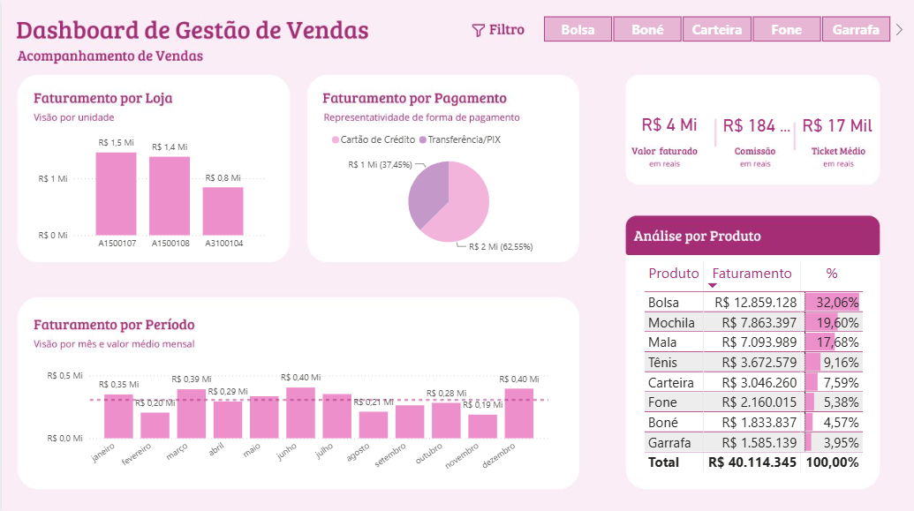

# Dashboard de Gestão de Vendas

Meu primeiro dashboard! 📊

Esse foi um dos meus primeiros projetos colocando em prática conceitos de análise e visualização de dados.

O dashboard foi criado para acompanhar indicadores de vendas, como faturamento por loja, faturamento por período, formas de pagamento e desempenho dos produtos.

Estou postando agora para deixar registrado o começo da minha evolução na área de dados e, futuramente, poder olhar para esse projeto e comparar com os próximos.

## Ferramentas

- Power BI
- Excel

## Dashboard

⚠️ Projeto inspirado no dashboard do canal Empowerdata.
